# Universidad de San Carlos de Guatemala
# Facultad de Ingenieria
# Escuela de Ciencias y Sistemas
# Estructura de Datos
# Sección C
# José Luis Saloj
# 201900081
---
---
# Manual Técnico - AutoGest Pro
---
---
## 1. Introducción
Sistema de gestión para talleres vehiculares desarrollado en **C#** con **GTK** para interfaces gráficas. Combina estructuras de datos avanzadas para optimizar el almacenamiento y consulta de información.

---
### 1. Diagrama de Arquitectura General - AutoGest Pro

### 2. Estructuras Utilizadas

| **Entidad**   | **Estructura**        | **Complejidad**   | **Archivo**                |
|---------------|-----------------------|-------------------|----------------------------|
| **Usuarios**  | Lista Simple          | O(1) inserción    | `ListaUsuarios.cs`         |
| **Vehículos** | Lista Doble           | O(n) búsqueda     | `ListaVehiculos.cs`        |
| **Repuestos** | Árbol AVL             | O(log n)          | `AVLRepuesto.cs`           |
| **Servicios** | Árbol Binario         | O(log n)          | `ArbolBinarioServicio.cs`  |
| **Facturas**  | Árbol B (Orden 5)     | O(log n)          | `ArbolBFactura.cs`         |

## 3. Componentes Principales

### 3.1 Módulos de Interfaz

| **Ventana**               | **Función**                              | **Métodos Clave**                      |
|---------------------------|------------------------------------------|----------------------------------------|
| **LoginWindow**            | Autenticación de usuarios               | `Validación de credenciales`           |
| **interfazAdmin**          | Menú principal con 7 opciones           | `Redirección a ventanas específicas`  |
| **CargaMasivaWindow**      | Carga desde JSON                        | `CargarUsuarios()`, `CargarVehiculos()`, `CargarRepuestos()` |
| **Gestión de entidades**      | Sirve para visualizar y eliminar vehículos y usuarios                        | `BuscarUsuarios(id)`, `EliminarUsuario(id)`, `BuscarVehiculo(id)`, `EliminarVehiculo(id)` |
| **ActualizarRepuestoWindow** | Modifica repuestos en AVL               | `OnBuscarClicked()`, `OnActualizarClicked()` |
| **VisualizarRepuesto** | Visualizar recorridos del AVL               | `PreOrden()`, `InOrden()`, `PostOrden()` |
| **GenerarServicio** | Crea un nuevo servicio de forma manual e inserta en árbol binario de busqueda               | `inserta(nodo)` |
| **GenerarFactura** | Crea una factura de forma automática e inserta en árbol B               | `inserta(nodo)` |
| **Logueo** | Verifica la existencia de usuarios               | `BuscarPorCorreo(correo)` |
| **Reportes** | Muestra de manera grafica cada uno de las estructuras utilizadas en el proyecto.               | `Datos.usuariosLista.GenerarGraphviz()`, `Datos.vehiculosLista.GenerarGraphviz()`, `Datos.repuestosArbol.GenerarGraphviz()`, `Datos.serviciosArbol.GenerarGraphviz()`, `Datos.facturasArbol.GenerarGraphviz()` |

## 4. Validaciones

| **Regla**                        | **Método**                | **Estructura**   |
|-----------------------------------|---------------------------|------------------|
| **ID único en usuarios**         | `ExisteUsuarioId()`       | Lista Simple     |
| **Referencia vehículo-usuario**  | `BuscarUsuarioId()`       | Lista Doble      |
| **Repuesto existente**           | `ExisteNodoPorId()`       | Árbol AVL        |

## 5 Salidas

| **Reporte**  | **Estructura Visualizada**    | **Archivo**      |
|--------------|--------------------------------|------------------|
| **Usuarios** | Lista enlazada simple         | `usuarios.png`   |
| **Repuestos**| Árbol AVL balanceado          | `repuestos.png`  |
| **Vehículos** | Lista doble enlazada  | `vehiculos.png`   |
| **Servicios**| Árbol Binario de Busqueda          | `servicios.png`  |
| **Facturas** | Árbol B con nodos de orden 5  | `facturas.png`   |

