# Universidad de San Carlos de Guatemala
# Facultad de Ingenieria
# Escuela de Ciencias y Sistemas
# Estructura de Datos
# Sección C
# José Luis Saloj
# 201900081
---
---
# Manual de Usuario - AutoGest Pro
---
---
## 1. Introducción
AutoGest Pro es un sistema de gestión diseñado para talleres de reparación de vehículos. Permite administrar usuarios, vehículos, repuestos, servicios y facturas de manera eficiente utilizando estructuras de datos avanzadas. Este manual explica cómo utilizar el sistema tanto para administradores como para usuarios regulares.

---

## 2. Acceso al Sistema
### 2.1 Inicio de Sesión
- **Pantalla de inicio**: Ingrese las credenciales proporcionadas.
  - **Administrador**:  
    - Usuario: `admin@usac.com`  
    - Contraseña: `admin123`  
  - **Usuarios registrados**: Utilice su correo y contraseña registrados.

  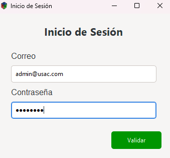


---

## 3. Rol Administrador
Ventana principal y funciones del administrador.

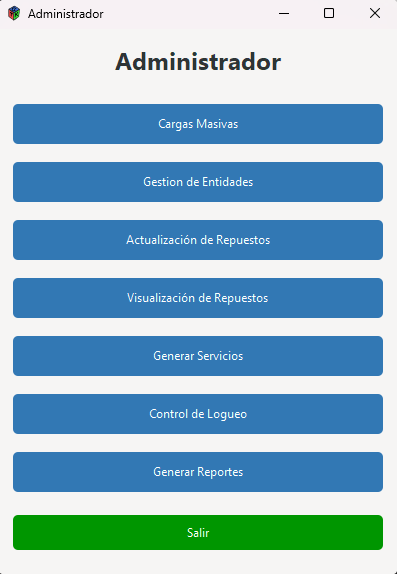
### 3.1 Carga Masiva
- **Ubicación**: Menú principal > "Carga Masiva".
- **Funcionalidad**:  
  - Seleccione la entidad a cargar (`Usuarios`, `Vehículos` o `Repuestos`).  
  - Cargue un archivo JSON con el formato especificado en el documento.  
  - Ejemplo de JSON para usuarios:  
    ```json
    [
        {
            "ID": 1,
            "Nombres": "Carlos Alberto",
            "Apellidos": "Gomez Martinez",
            "Correo": "carlos.alberto@usac.com",
            "Edad": 20,
            "Contrasenia": "CarlosMartinez"
        },
        {
            "ID": 2,
            "Nombres": "Ana Lucia",
            "Apellidos": "Martinez Lopez",
            "Correo": "ana.lucia@usac.com",
            "Edad": 20,
            "Contrasenia": "AnaLopez"
        }
    ]  
    ```
    - Ejemplo de JSON para vehículos:  
    ```json
    [
        {
            "ID": 1,
            "ID_Usuario": 1,
            "Marca": "Honda Civic",
            "Modelo": 2005,
            "Placa": "XZJ7H9K"
        },
        {
            "ID": 2,
            "ID_Usuario": 2,
            "Marca": "Toyota Corolla",
            "Modelo": 2010,
            "Placa": "JKS8T5A"
        }
    ] 
    ```
     - Ejemplo de JSON para repuestos:  
    ```json
    [
        {
            "ID": 1,
            "Repuesto": "Filtro de aceite",
            "Detalles": "Filtro de aceite para motor 1.8L",
            "Costo": 15.75
        },
        {
            "ID": 2,
            "Repuesto": "Bujías",
            "Detalles": "Juego de bujías para motor 2.0L",
            "Costo": 30.50
        }
    ]
    ```

### 3.2 Gestión de Entidades
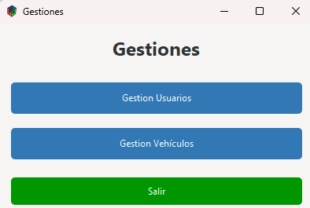
- **Visualizar/Eliminar**:  
  - Seleccione `Usuarios` o `Vehículos` en el menú.  
  - Busque registros por ID y elimínelos si es necesario. 
  - Ventana `usuarios`
  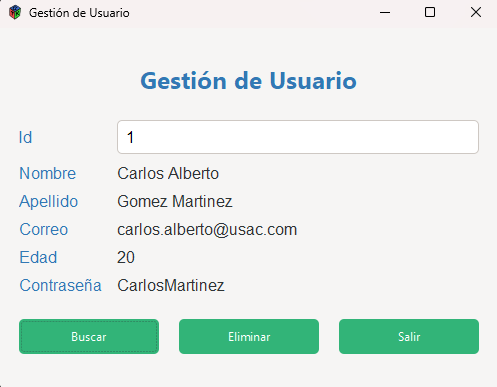 
  - Ventana `usuarios`
  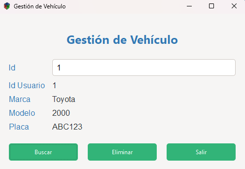
### 3.3 Actualización de Repuestos
  - Busca un repuesto por Id.  
  - Modifica los campos de un repuesto mediante el id.
  - Ventana actualización
  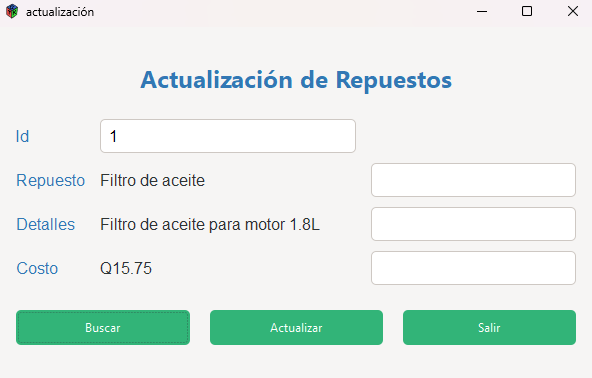

### 3.4 Visualización de Repuestos
  - El administrador puede visualizar los respuestos en los distintos órdenes `PRE-ORDEN`, `IN-ORDEN`, `POST-ORDEN`.
  - Venta de visualizaciones
  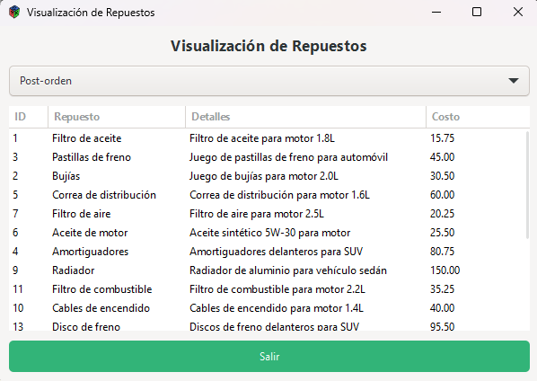

### 3.5 Crear Servicio
  - El administrador puede crear servicios, donde se debe validad la existencia del repuesto y vehículo a través del id.
  - Crea de forma automática una factura para el usuario.
  - Ventana de crear servicios
  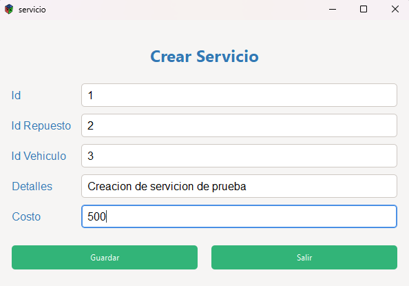

### 3.6 Control de Logueo
  - Verifica que el usuario exista en el sistema para poder realizar acciones como: 
    1. Insertar vehículos de forma manual.
    2. Visualizar servicios.
    3. Visualizar facturas.
    4. Cancelar facturas.

### 3.7 Reportes
- **Generación**:  
  - Crea imágenes de las estructuras de datos (usuarios, vehículos, repuestos, servicios y facturas). 
  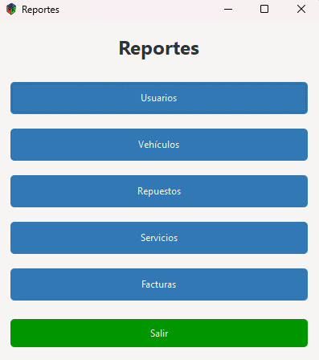
  - `Usuarios`
  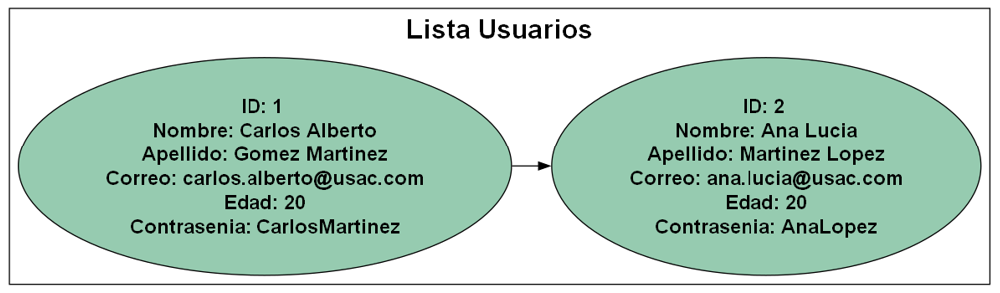
  - `Vehículos`
  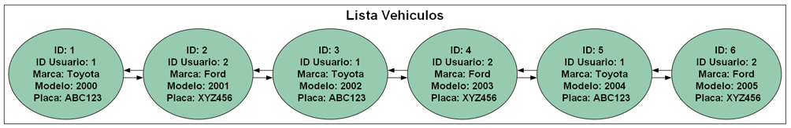
  - `Repuestos`
  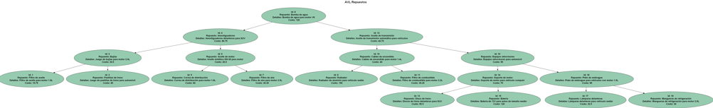
  - `Servicios`
  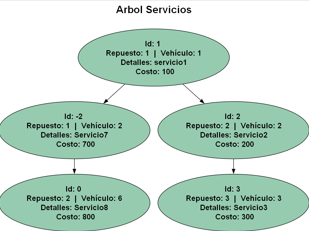
  - `Facturas`
  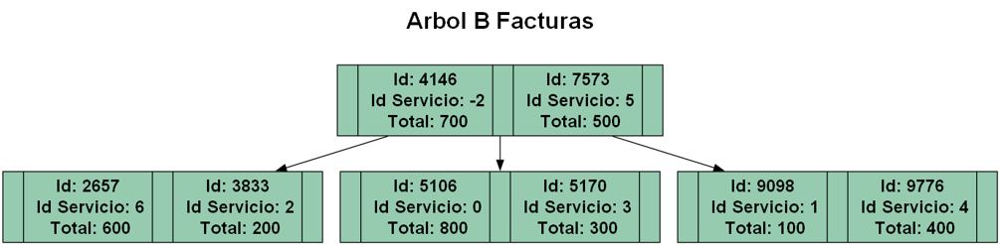

---

