# Universidad de San Carlos de Guatemala
# Facultad de Ingenieria
# Escuela de Ciencias y Sistemas
# Estructura de Datos
# Sección C
# José Luis Saloj
# 201900081
---
---
# Manual de Usuario - AutoGest Pro
---
---
## 1. Introducción
AutoGest Pro es un sistema de gestión diseñado para talleres de reparación de vehículos. Permite administrar usuarios, vehículos, repuestos, servicios y facturas de manera eficiente utilizando estructuras de datos avanzadas. Este manual explica cómo utilizar el sistema tanto para administradores como para usuarios regulares.

---

## 2. Acceso al Sistema
### 2.1 Selección de rol
- **Ventana de selección de rol**: Se puede ingresar como administrador o como usuario.
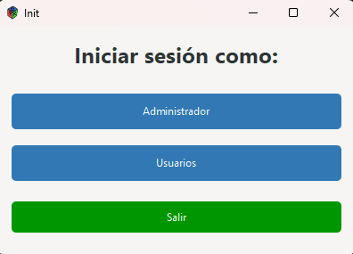

---

### 2.2 Inicio de Sesión
- **Pantalla de inicio**: Ingrese las credenciales proporcionadas.
  - **Administrador**:  
    - Usuario: `admin@usac.com`  
    - Contraseña: `admin123`
  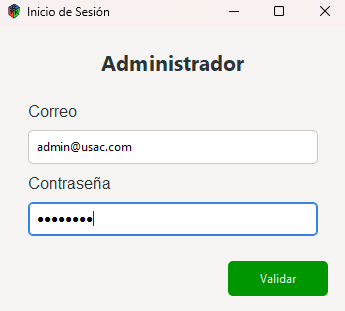  
  - **Usuarios registrados**: Utilice su correo y contraseña registrados.
  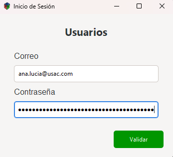


---

## 3. Rol Administrador
Ventana principal y funciones del administrador.

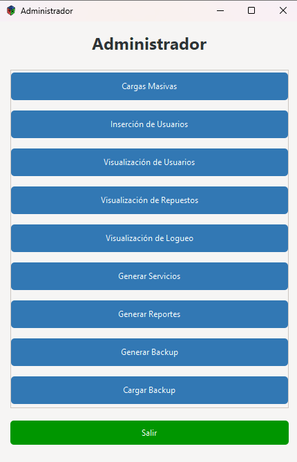
### 3.1 Carga Masiva
- **Ubicación**: Menú principal > "Carga Masiva".
- **Ventana:**
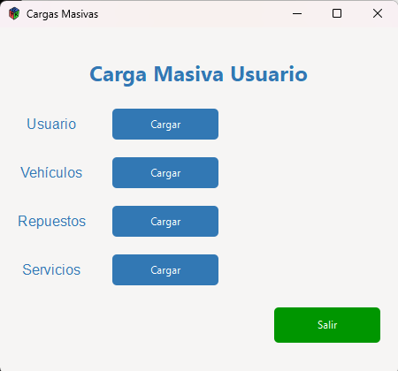
- **Funcionalidad**:  
  - Seleccione la entidad a cargar (`Usuarios`, `Vehículos`, `Repuestos` o `Servicios`).  
  - Cargue un archivo JSON con el formato especificado en el documento.  
  - Ejemplo de JSON para usuarios:  
    ```json
    [
        {
            "ID": 1,
            "Nombres": "Carlos Alberto",
            "Apellidos": "Gomez Martinez",
            "Correo": "carlos.alberto@usac.com",
            "Edad": 20,
            "Contrasenia": "CarlosMartinez"
        },
        {
            "ID": 2,
            "Nombres": "Ana Lucia",
            "Apellidos": "Martinez Lopez",
            "Correo": "ana.lucia@usac.com",
            "Edad": 20,
            "Contrasenia": "AnaLopez"
        }
    ]  
    ```
    - Ejemplo de JSON para vehículos:  
    ```json
    [
        {
            "ID": 1,
            "ID_Usuario": 1,
            "Marca": "Honda Civic",
            "Modelo": 2005,
            "Placa": "XZJ7H9K"
        },
        {
            "ID": 2,
            "ID_Usuario": 2,
            "Marca": "Toyota Corolla",
            "Modelo": 2010,
            "Placa": "JKS8T5A"
        }
    ] 
    ```
     - Ejemplo de JSON para repuestos:  
    ```json
    [
        {
            "ID": 1,
            "Repuesto": "Filtro de aceite",
            "Detalles": "Filtro de aceite para motor 1.8L",
            "Costo": 15.75
        },
        {
            "ID": 2,
            "Repuesto": "Bujías",
            "Detalles": "Juego de bujías para motor 2.0L",
            "Costo": 30.50
        }
    ]
    ```
    - Ejemplo de JSON para servicios:  
    ```json
    [
        {
        "Id": 9,
        "Id_repuesto": 5,
        "Id_vehiculo": 12,
        "Detalles": "Calificacion servicio 2",
        "Costo": 100,
        "MetodoPago": "Tarjeta"
      },
      {
        "Id": 3,
        "Id_repuesto": 4,
        "Id_vehiculo": 4,
        "Detalles": "Calificacion servicio 3",
        "Costo": 50,
        "MetodoPago": "Efectivo"
      }
    ]
    ```

### 3.2 Insertar Usuario
- **Insertar usuario**:  
  El administrador puede agregar un nuevo usuario. 
  
  **Ventana** `usuarios`
  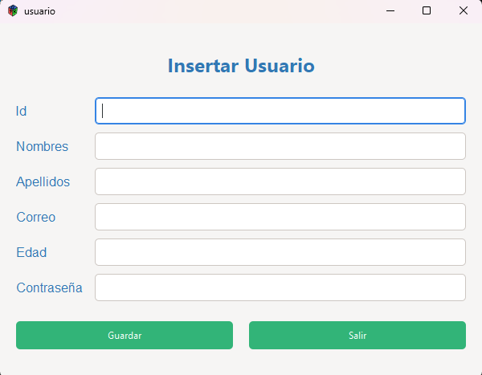 
### 3.3 Visualizar Usuarios
  - **Buscar por id**:
  El administrador puede consultar la existencia de los usuarios mediante el id.
  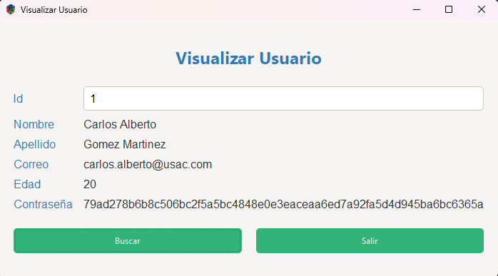

### 3.4 Visualización de Repuestos
  - El administrador puede visualizar los respuestos en los distintos órdenes `PRE-ORDEN`, `IN-ORDEN`, `POST-ORDEN`.
  - Venta de visualizaciones
  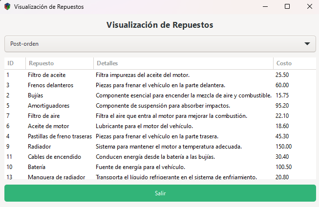

### 3.5 Visualización de Logueo
  - El administrador puede visualizar los usuarios logueados en el sistema mediante un archivo json.
  - Ventana de visualización de logueo
  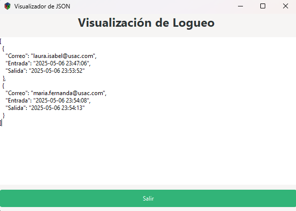

### 3.6 Generar Servicio
  - El administrador puede crear servicios, donde se debe validad la existencia del repuesto y vehículo a través del id.
  - Crea de forma automática una factura para el usuario.
  - Ventana de crear servicios
  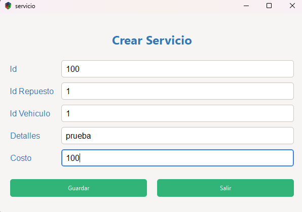


### 3.7 Generar Reportes
- **Generación**:  
  - Crea imágenes de las estructuras de datos (usuarios, vehículos, repuestos, servicios, facturas, grafo no dirigido y control de logueo).
  - Ventana de generación de reportes
  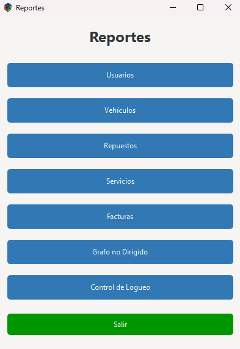

  - `Usuarios`
  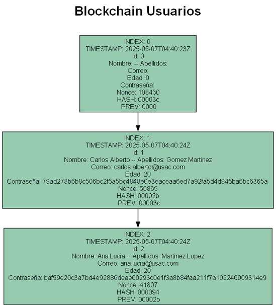
  - `Vehículos`
  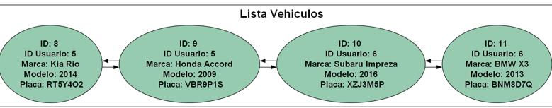
  - `Repuestos`
  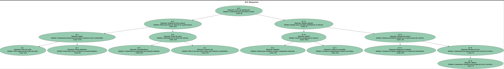
  - `Servicios`
  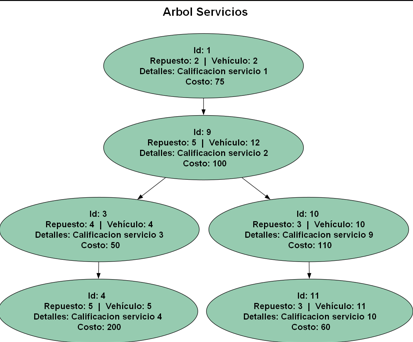
  - `Facturas`
  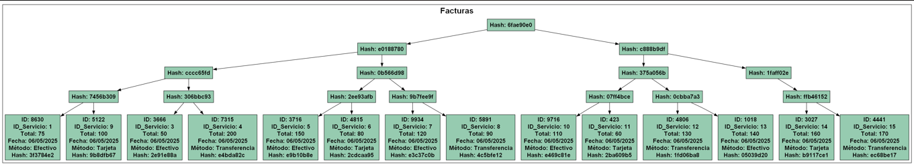
  - `Grafo no dirigido`
  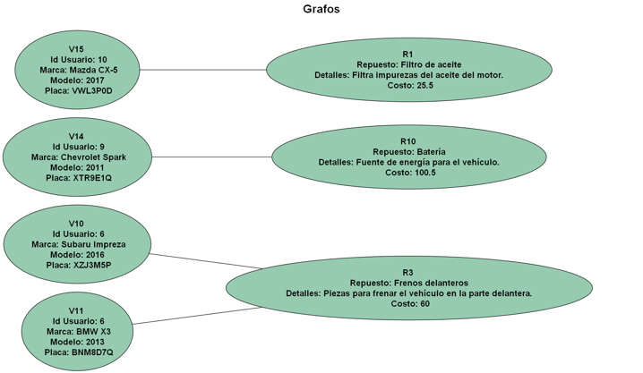
  - `Control de logueo`
  

  ### 3.8 Generar Backup
- **Generación**:
  - Crea un archivo comprimido con la información de los usuarios, vehículos, repuestos, servicios y facturas.

  ### 3.9 Cargar Backup
- **Cargar**:
  - Permite cargar un archivo comprimido con la información de los usuarios, vehículos, repuestos, servicios y facturas.
  - Ventana de carga de backup

---

## 4. Rol Usuario
- **Ventana principal**:  
  - El usuario puede ver sus vehículos, repuestos y servicios.
  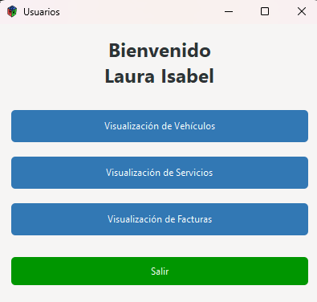

  ### 4.1 Visualizar Vehículos
  - **Visualización**:
    - El usuario puede ver sus vehículos registrados en el sistema.
    - Ventana de visualización de vehículos
  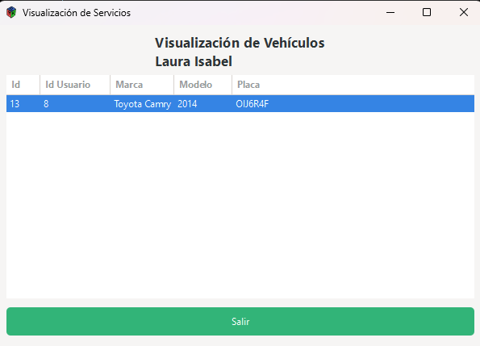

  ### 4.2 Visualizar Servicios
  - **Visualización**:
    - El usuario puede ver los servicios realizados en su vehículo.
    - Ventana de visualización de servicios
  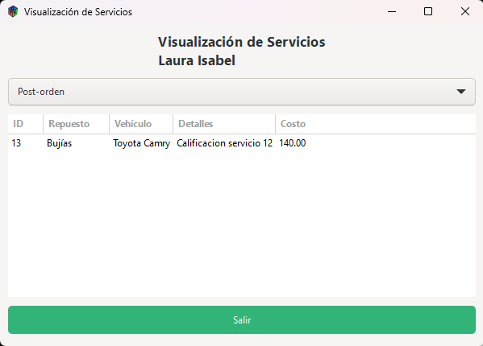

  ### 4.3 Visualizar Facturas
  - **Visualización**:
    - El usuario puede ver las facturas generadas por los servicios realizados en su vehículo.
